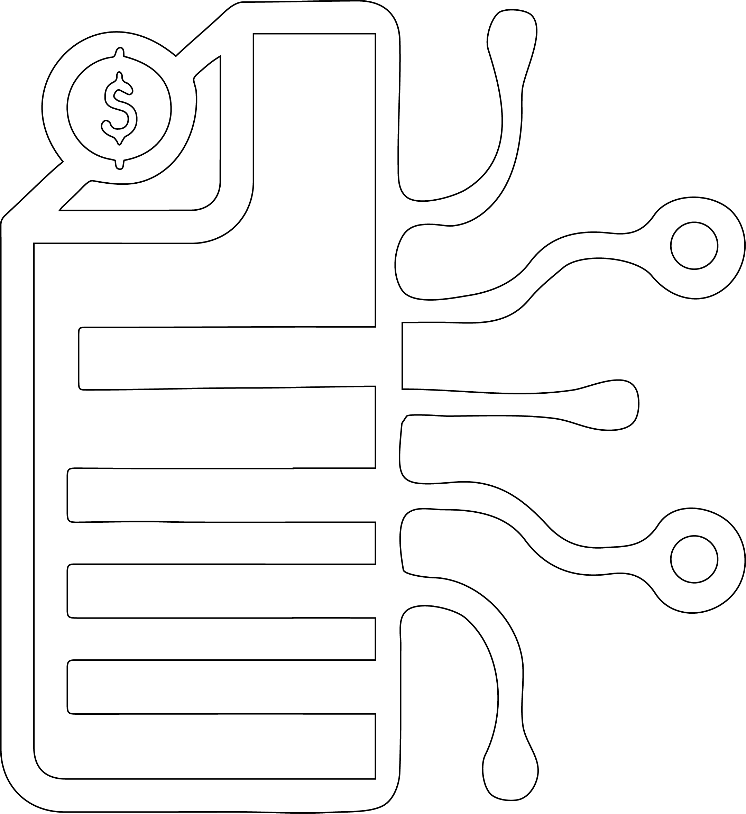
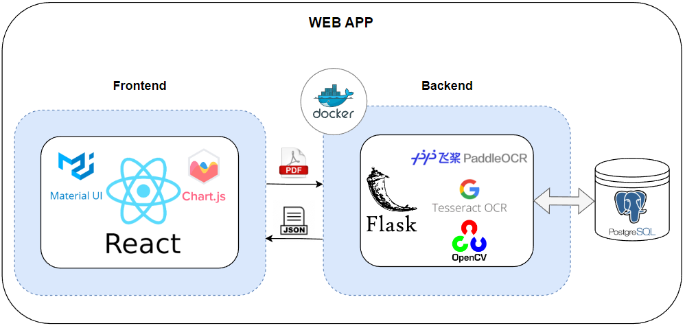
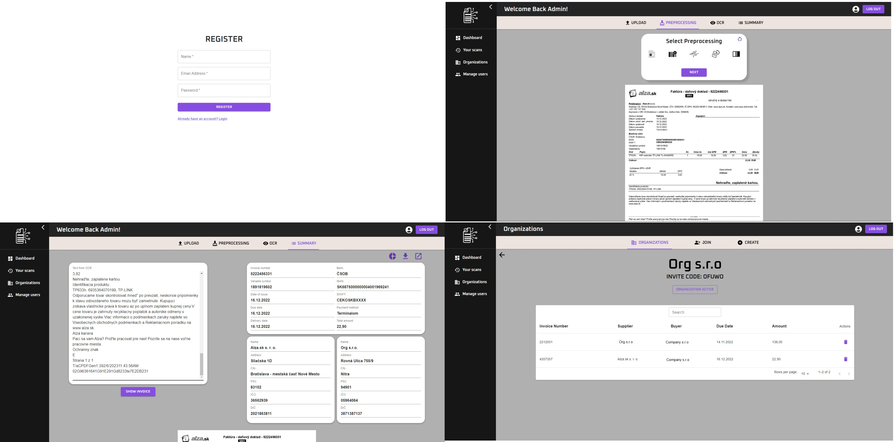

 <p align="center"></p>
 <h1 align="center">Invoice OCR App</h1>

<p align="center">
  
</p>

Web application for recognizing and managing data from Slovak invoices.

## 📚 Table of Contents
1. [🌐 General Info](#general-info)
2. [🌟 Features](#features)
3. [🏗️ Tech Stack](#tech-stack)
4. [📸 Screenshots](#screenshots)
5. [🚀 Installation](#installation)
6. [🔮 Future Work](#future-work)

## 🌐 General Info
This web application provides the recognition and management of Slovak invoices. Users can upload invoices to the platform where they can apply various pre-processing methods to optimize OCR results. 
Users can then choose from available OCR methods such as Tesseract or PaddleOCR for text recognition.

From the recognized text, the application extracts important information that users can further manipulate according to their needs. 
The app also allows you to create organizations where invoices can be shared between multiple users. 
This comprehensive and user-friendly system streamlines invoice processing, saves time and increases accuracy.

## 🌟 Features
List of features included in the application.
* Recognize and extract information from invoices in image or PDF format
* User registration and authentication
* The system allows users to choose preprocessing and OCR methods
* The system can extract important information from invoices, at least VAT number, IBAN,
SWIFT, amount to be paid
* The system can store and store invoice information in the database
* The system enables searching and filtering invoices based on extracting data from invoices
* Ability to view, edit, and delete recognized invoices

## 🏗️ Tech Stack
Invoice OCR App is built with the following technologies:
- **Python**: For backend server development
- **Flask**: Manages the backend server
- **React**: Powers the frontend user interface
- **OpenCV**: Handles invoice image preprocessing
- **Tesseract OCR & PaddleOCR**: Handles text recognition from invoices
- **PostgreSQL**: Database for storing invoice details and user data
- **Docker**: Ensures smooth setup through containerization

### Project structure


## 🚀 Installation
Here are the steps to get this application up and running:

1. **Clone the repository**
    ```
    git clone https://github.com/MatKollar/Invoice_OCR_app.git
    ```
2. **Navigate into the project directory**
    ```
    cd Invoice_OCR_app
    ```
3. **Build the Docker image**
    ```
    docker-compose build
    ```
4. **Run the Docker container**
    ```
    docker-compose up -d
    ```
5. The application should now be running at [http://localhost:3000](http://localhost:3000)

6. After initialization, an admin user is automatically created with login e-mail and password: admin, admin.

## 📸 Screenshots


## 🔮 Future Work
* Implementation of NER (Named Entity Recognition) for data extraction
* Support more language models
* Data extraction support for international invoices
